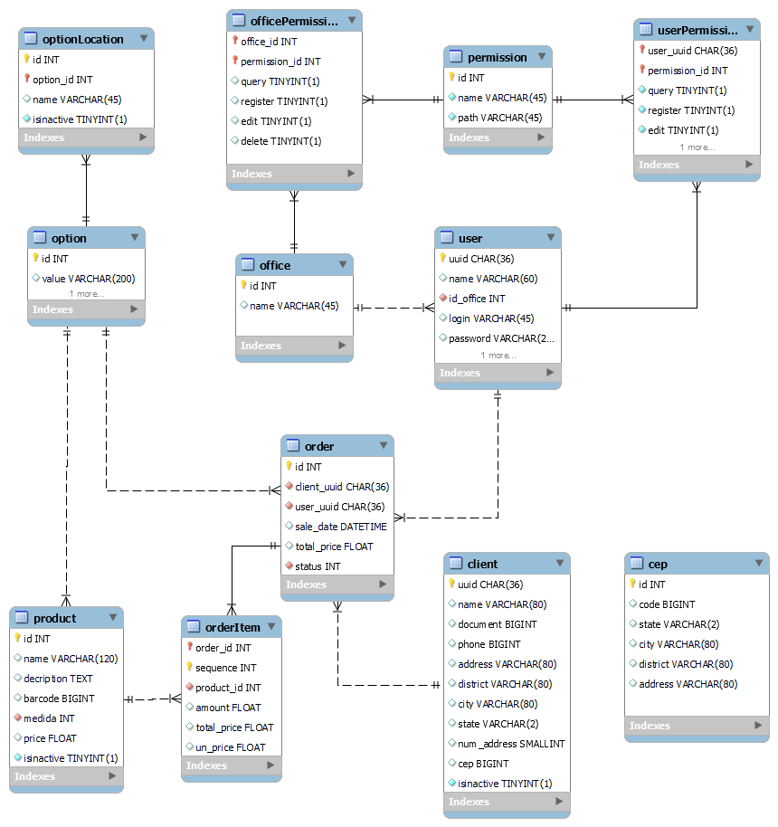

# Trabalho de Frameworks

## ***Ferramentas:***
* Front: Vite, Vue, Bootstrap
* Backend: Node.JS, Express, Sequelize, Postgres
* API CEP: https://viacep.com.br/ws/[CEP]/json/

## ***Executando***
* Front: 
  * cd ./front
  * yarn
  * yarn dev
  
* Backend:
  * cd ./backend
  * copiar .env.example para .env e preencher as variaveis de dev para conexão com banco
  * npm i
  * npm run dev

## ***Rotas Front:***
* /login - Pagina de login Erp
* /dashboard - Pagina Principal
* /user - Pagina com listagem e filtros
* /user/{uuid} - Visualiza informações do usuario podendo editar
* /product - Pagina com listagem e filtros
* /product/{id} - Pagina permite visualizar e alterar informações
* /client - Pagina com listagem e filtros
* /client{uuid} - Pagina permite visualizar e alterar informações
* /orders - Listagem das vendas e fitros por status e cliente
* /orders/{id} - Pagina permite visualizar venda
* /report - Listagem de relatórios
* /report/orders - Relatório de vendas
* /report/client - Relatórios de clientes

## ***Rotas Backend:***
* /login [POST] - BasicAuth
* /user [GET,POST] - Usado para recuperar todos usuarios e cadastrar
* /user/{uuid} [GET,PUT] - Busca user completo ou alterar usuario
* /product [GET,POST] - Consultar e cadastrar produtos
* /product/{id} [GET,PUT] - Busca informarções do produto e altera cadastro
* /client [GET,POST] - Busca todos clientes e cadastra cliente
* /client{uuid} [GET,PUT] - Busca informarções do cliente e altera cadastro
* /orders [GET,POST] - Busca todas as vendas e cadastra nova venda
* /orders/{id} [GET,PUT] - Busca informarções da venda e altera venda se não tiver finalizada
* /office [GET,POST] - Busca e cadastra cargos
* /office/{id} [GET,PUT] - Busca e alterar um cargo
* /permission [GET,POST] - Busca e cadastra permissões
* /permission/{id} [GET,PUT] - Busca e altera uma permissão

## ***Tabelas:***

